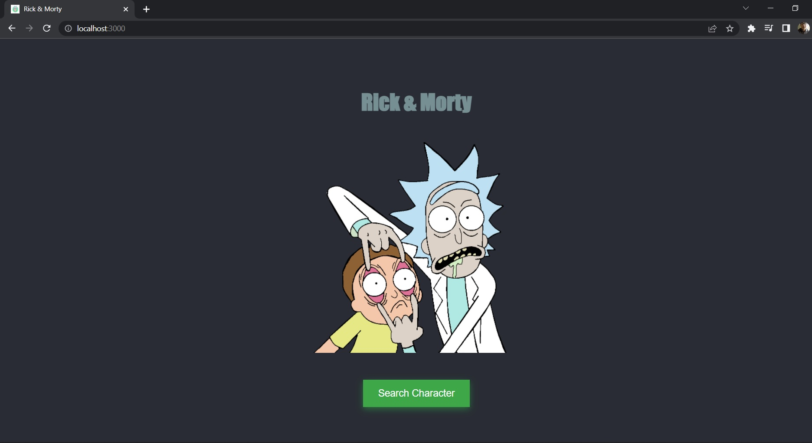
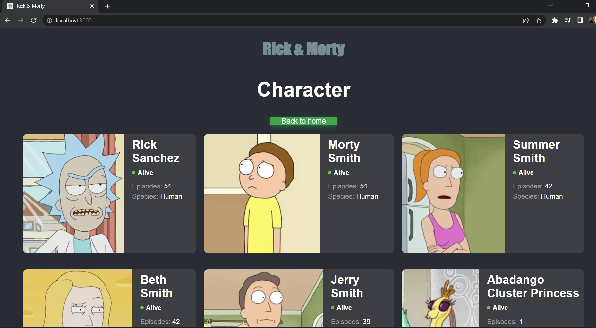

# Rick & Morty 

## Description
Rick and morty cards using an api

## STACK
- HTML5
- CSS3
- JavaScript
- ReactJs
- Fetch

## Installation

Clone the project 

```bash
  git clone https://github.com/JesusLeonChavez/demo-rick-morty-fetch.git
```

Installation

```bash
  npm i
```

Start Client

```bash
  npm start
```

## Public Routes
Accessible Routes:

* Home



* Characters1



* Characters2


## Api

https://rickandmortyapi.com/